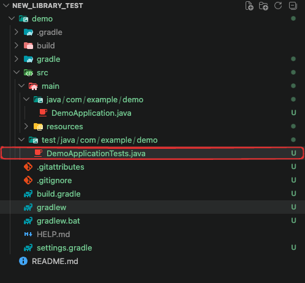
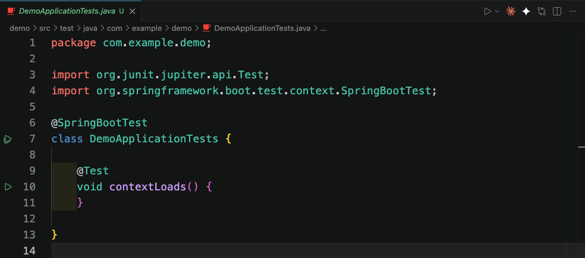
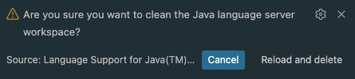
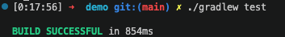
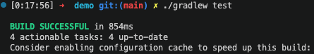

이 포스팅은 Testcontainers에 대해 간단하게 알아보는 글입니다. 처음 Testcontainers에 대해 궁금하시다면  지금 바로 들어갑시다.

>1. TestContainers를 배우기 전 필요한 사전 지식
>2. Testcontainers란 무엇인가?
>3. Testcontainers의 동작 원리(Life Cycle)
>4. 처음 사용자를 위한 단계별 가이드 (Java/Spring Boot Example)

## 1. Testconatiners를 배우기 전 필요한 사전 지식
---
이 도구를 온전히 이해하고 적극적으로 활요하기 위해서는 다음 두 가지 지식을 알고 가시면 쉽게 접근할수 있습니다.
* **Docker(도커)기초**
Testcontainers는 내부적으로 Docker를 좆가하는 라이브러리 입니다. 컨테이너(Container), 이미지(image), 포트 포워딩(Port Forwarding), 환경변수 (Environment Variables)에 대해 무엇인지 이해할 필요가 있습니다.

* **통합 테스트(Integration Test)개념**
데이터 베이스, 메시지 큐(kafka, RabbitMQ등)와 같은 외부 시스템과 내 애플리케이션이 잘 연동되는지 확인하는 테스트에 대한 이해가 필요합니다.(Junit같은 테스트 프레임워크 사용법도 포함됩니다.)
---

## 2. Testcontainers란 무엇인가?
공식 문서에 따르면 Testcontainers는 Docker 컨테이너에 의존하는 통합 테스트를 지원하는 오픈소스 라이브러리 입니다.

기존에는 통합 테스트를 할대 다음과 같은 문제가 있었습니다.

1. **H2 같은 인메모리 DB 사용**
    공식 문서에서는 H2를 사용한 테스트를 "가짜(Fake)환경" 이라고 부릅니다. H2는 MySQL이나 PostgreSQL의 고유한 문법(Dialect), 트랜잭션 격리 수준, 인덱스 동작 방식을 100% 완벽하게 모방할 수 없습니다.
    로컬(H2)에서는 통과했던 쿼리가 운영(MySQL)에서는 에러를 뺕는 상황이 발생하할수 있습니다.

2. **로컬에 직접 DB 설치**
    개발자마다 로컬 환경이 달라 "제 PC에서는 되는데요?" 같은 문제가 발생합니다.

3. **공용 테스트 DB 사용**
여러 개발자나 CI 서버가 동시에 테스트를 돌리면 데이터 충돌이 발생합니다.

**Testcontainers의 해결책**
Testcontainers의 철학은 "운영 환경에서 MySQL 8.0을 쓴다면, 테스트 환경에서도 MySQL 8.0을 써야 한다" 입니다.
의존성을 피하는 대신, Docker 이용해 그 의존성을 "테스트가 실행될 때만 잠깐 살았다가 죽는 일회용(Ephemeral)'으로 만들어 버리는 것입니다.
테스트 코드가 실행될 때, 코드를 통해 Docker에게 "PostgreSQL 컨테이너 하나 띄워줘" 라고 명령합니다.
테스트가 끝나면 띄웠던 컨테이너를 깔끔하게 삭제합니다.
즉, 외부 의존성을 Mocking(가짜 객체)하지 않고,
"진짜" 시스템을 일회용으로 띄워서 테스트하는 완벽히 독립적이고 재현 가능한 환경을 제공합니다.


<br />
<br />

## 3.Testcontainers의 동작 원리(Life Cycle)
---
테스트 코드를 실행했을 때 내부적으로 일어나는 과정은 다음과 같습니다.

1. **Docker 데몬 연결**
Testcontainers 라이브러리가 로컬(또는 CI 환경)에 실행 중인 Docker 데몬(Docker Engine)과 통신을 시작합니다.

2. **Ryuk 컨테이너 실행**
Testcontainers는 가정 먼저 **Ryuk(류크)** 라는 이름의 숨겨진 컨테이너를 띄웁니다. 이 컨테이너의 유일한 목적은 "가비지 컬렉션(Garbage Collection)" 입니다.
텍스트가 성공하든, 실패하든, 심지어 강제로 종료되더라도 띄워진 컨테이너와 네트워크 자원들을 확실하게 정리(삭제)하는 역활을 합니다.

3. **요청한 컨테이너 실행 및 포트 매핑**:
테스트 코드에서 요청한 DB나 서비스(예: PostgreSQL)의 이미지를 Pull 받고 컨테이너를 실행합니다.
이때 포트는 무작위(Random)로 할당됩니다.
(예: 호스트의 5432 포트가 이미 사용 중이더라도 충돌하지 않게 32849 같은 랜덤 포트와 연결합니다.)

4. **Wait Strategy(대기 전략)**:
컨테이너가 실행되었다고 해서 내부에 있는 DB가 즉시 쿼리를 받을 수 있는 것은 아닙니다.
Testcontainers는 DB가 완전히 부팅되어 연결을 수락할 준비가 될 때까지 기다립니다.
(예: 특정 로그가 출력될 때까지 대기, 특정 포트가 열릴 때까지 대기)

5. **테스트 실행:**
애플리케이션이 이 랜덤 포트로 연결하여 테스트 로직을 수행합니다.

6. **자원 정리**:
테스트가 종료되면 Ryuk 컨테이너가 나서서 방금 사용한 컨테이너, 볼륨, 네트워클르 모두 삭제하고 자신도 종료됩니다.

<br />
<br />

## 4. 처음 사용자를 위한 단계별 가이드 (Java/Spring Boot Example)
---
Testconatiners는 Go, Node.js, Python 등 다양한 언어를 지원하지만, 가장 널리 사용되는 Java(Spring Boot)와 JUnit5를 기준으로 작성되었습니다.

#### 1step: 로컬 환경에서 Docker실행
Testcontainers는 Docker에 의존하므로, 컴퓨터에 Docker Desktop이나 Colima, OrbStack 등이 설치되어 있고 실행 중이어야 합니다.

<br />

#### 2step: 의존성(Dependency)추가
프로젝트 `build.gradle` (또는 pom.xml)에 라이브러리를 추가합니다.

```gradle
// Junit5를 위한 Testcontainers 코어
testImplementation 'org.testcontainers:junit-jupiter:1.19.3'
// 사용할 특정 모듈 (예: PostgreSQL)
testImplementation 'org.testcontainers:postgresql:1.19.3'
```
<br />

의존성을 추가했으면 build를 다시 Reload해야 겠죠?
아래 명령어를 사용하여 의존성을 다시 다운로드 합니다.
**명령어**
```bash
./gradlew --refresh-dependencies
```
Terminal 창에 작성하면 reload가 됩니다.!

<br />

#### 3step: 테스크 코드 작성
가장 기본적인 통합 테스트 구조입니다.



빨간 네모 위치 `DemoApplicationTEsts.java`를 확인해 보면

이렇게 기본 세팅 코드가 적혀 있는것을 지우고 밑에 있는 코드를 작성해 봅니다.
```java

package com.example.demo; // 1. 메인 클래스와 똑같은 패키지명 작성 (필수)
import org.junit.jupiter.api.Test;
import org.springframework.boot.test.context.SpringBootTest;
import org.springframework.test.context.DynamicPropertyRegistry;
import org.springframework.test.context.DynamicPropertySource;
import org.testcontainers.containers.PostgreSQLContainer;
import org.testcontainers.junit.jupiter.Container;
import org.testcontainers.junit.jupiter.Testcontainers;

@SpringBootTest
@Testcontainers // Testcontainers 확장을 사용하겠다고 선언
class MyRepositoryIntegrationTest {

    // @Container: 이 컨테이너의 생명주기를 테스트 클래스와 맞춤
    @Container
    static PostgreSQLContainer<?> postgres = new PostgreSQLContainer<>("postgres:15-alpine")
            .withDatabaseName("testdb")
            .withUsername("testuser")
            .withPassword("testpass");

    // Spring Boot 애플리케이션에 랜덤으로 할당된 DB 접속 정보를 동적으로 주입
    @DynamicPropertySource
    static void configureProperties(DynamicPropertyRegistry registry) {
        registry.add("spring.datasource.url", postgres::getJdbcUrl);
        registry.add("spring.datasource.username", postgres::getUsername);
        registry.add("spring.datasource.password", postgres::getPassword);
    }

    @Test
    void testDatabaseConnection() {
        // 이 시점에는 실제 PostgreSQL 컨테이너가 띄워져 있고,
        // Spring Boot가 거기에 성공적으로 연결된 상태입니다.
        // 여기에 Repository 저장/조회 검증 로직을 작성합니다.
        System.out.println("컨테이너 DB URL: " + postgres.getJdbcUrl());
    }
}
```

* `@Testconatiners` & `@Container`: 
테스트가 시작할 때 컨테이너를 켜고, 끝날 때 꺼주는 어노테이션 입니다.(`static`으로 선언하면 클래스의 모든 테스트가 하나의 컨테이너를 공유하고, 인스턴스 변수로 선언하면 테스트 메서드마다 새 컨테이너를 띄웁니다.)

* `@DynamicPropertySource`:
Testcontainers가 동적으로 할당된 랜덤 포트(JDBC URL)를 Spring의 설정 값(`applicaion.yml`에 있는 값 대신)으로 덮어씌워 줍니다

작성을 했는데 빨간줄과 함께 오류가 생길수 있습니다.

위에 import부분에서 오류가 시작된다면
라이브러리는 적혀있는데 에디터가 인식을 못 하는 경우(동기화 문제)일 가능성이 높습니다.

컴퓨터 입장에서 바라본다면
파일만 수정해 두고 에디터에 "변경된 사항을 반영해서 다운로드해 줘!"라고 알려주지 않았잖아 라고 생각하면 됩니다.

**VS Code Java 설정 초기화**
1. `Ctrl + Shift + P` (Mac은 `Cmd + Shift + P`)를 눌러 명령어 팔레트를 엽니다.
2. `java: clean java language server workspace`를 타이핑하고 선택합니다.
3. `Reload and delete` 버튼을 누른다. (문구의 내용은 해석해 보길 바란다.!)


그러면 에러가 사라지는 것을 확인할수 있다.


그리고 나서 잘 작동하는지 확인하기 위해
**명령어**
```bash
./gradle.test
```
작성을 했더니 결과값을 확인하려고 하니


build successful를 보면 854ms 즉 1초도 안돼서 성공했다고 나왔다.

성공하면 된거 아니야?!

여기서 잘 생각해보면 `testcontainers`는 `docker`기반인데 `docker`를 띄우기 위해서는 아무리 좋은 컴퓨터라도 2초 정도는 걸린다.
내 컴퓨터는 더 걸리지만...

즉 저 결과는 `testcontainers`가 실행도 되지 않았다는것!!!


혹시나 해서 `docker`가 켜져 있지 않은지 확인하기 위해서
**명령어**
```bash
docker ps
```
로 확인을 해보니 잘 켜져있는것을 확인할수 있다.

그러면 문제는
Gradle의 `Incremental Build(증분 빌드)` 때문이다.


여기서 보면 `4 up-to-date`라고 되어 있는 것을 확인할수 있다.

## 수정 필요


<br />
<br />


그러면 이것을 해결하기 위해서 이전에 성공했던 기록을 지우고 다시 테스트 하는 것입니다.

```bash
./gradlew clean test
```
만약에 제대로 실행 되었는지 로그를(INFO 레벨까지) 보고 싶다면 `--info`옵션을 붙여 주면 된다.

```bash
./gradlew clean test --info
```


## 그러면 이제 다시 test를 돌려보자
```bash
./gradlew test   
```

### 로그 분석
1. **Ryuk(관리자)실행**
* `INFO tc.testcontainers/ryuk:0.14.0 -- Creating container...`
* 테스트가 끝나면 컨테이너들을 청소해 줄 '청소부' 컨테이너가 가장 먼저 뜬것을 확인할수 있습니다다.

2. **PostgreSQL 컨테이너 실행**
* `INFO tc.postgres:15-alpine -- Creating container...`
* 설정한 대로 가벼운 Alpine 리눅스 기반의 Postgres 15버전이 실행되어 있는것을 확인할수 있습니다.

3. **랜덤 포트 할당 완료**
* `Container is started (JDBC URL: jdbc:postgresql://localhost:52274/testdb...)`
* 원래 Postgres는 5432를 쓰지만, Testcontainers가 충돌을 피해 52274라는 랜덤 포트를 열어주었습니다.

4. **Spring Boot와의 연결**
* `Starting MyRepositoryIntegrationTest using Java 17...`

* 스프링 부트가 뜨면서 방금 만들어진 52274 포트의 DB에 성공적으로 접속했습니다.

5. **테스트 코드 실행 결과**
* `컨테이너 DB URL: jdbc:postgresql://localhost:52274/testdb?loggerLevel=OFF`
* 작성하신 `System.out.println`이 실행되면서 실제 접속 정보를 콘솔에 찍어주었습니다.

이렇게 testconatiners를 직접 간단하게 잘 돌아가는 확인해볼수 있었습니다.


## GitHub actions (CI) 환경에서의 Testcontainers 도입
---
CI 서버에 Docker를 설치하고 띄우려면 무겁고 돈이 많이 들지 않을까? 라는 현실적인 고민이 들수 있습니다.
* 구현 가능 여부
    * GitHub Actions에서 제공하는 기본 `ubuntu-latest` 호스트 러너(Runner)에는 이미 Docker와 Docker Compose가 기본적으로 설치되어 실행중 입니다.
    <br />
    따라서 CI 스크립트(yml)에 Docker를 설치하는 로직을 짤 필요 없이, 로컬에서 하던 것처럼 `./gradlew test`만 실행하면 Testcontainers가 알아서 CI의 Docker 엔진을 사용해 컨테이너를 띄웁니다.

* **비용**
    * GitHub Actions는 공개(Public) 저장소의 경우 무료이며, 비공개(Private)저장소도 매월 일정 시간의 무료 크레딧을 제공합니다.
    * Testcontainers 자체는 무료 오픈소스 입니다.

* 속도(Trade-off 존재)
    * H2를 띄우는 것보다는 당연히 컨테이너 이미지를 다운받고(Pull) 부팅하는 시간이 수 초~십여 초 정도 더 걸립니다.
    <br />
    하지만 약간의 테스트 시간을 희생하는 대신 운영 환경에서의 DB 장애를 미리 막아줄수 있다는 신뢰성을 얻는 큰 장점이 있습니다.


질문 모음
**Q1. "테스트 클래스가 10개인데, 그럼 컨테이너도 10번 껏다 켜지나요? 너무 느려질 것 같은데요."**
* 기본 설정으로는 테스트 클래스마다 켜고 꺼질 수 있습니다. 이를 해결하기 위해 공식 문서에서는 **Singleton Containers(싱글톤 패턴)** 방식을 권장합니다.
스프링 생명주기와 맞춰 테스트가 처음 시작될 때 컨테이너를 딱 한 번만 띄우고, 모든 테스트 크래스가 그 DB 하나를 공유해서 사용한 뒤 마지막에 끄는 방식으로 속도를 최적화할 수 있습니다.

**Q2. 테스트가 끝날 때마다 데이터를 다 지워줘야 다음 테스트에 영향을 안 주지 않나요?**
* 맞습니다. 싱글톤 패턴으로 하나의 DB를 공유할 경우 데이터 오염이 발생할 수 있습니다. 이럴 때는 `@Transactional` 어노테이션을 테스트 메서드에 붙여서, 테스트가 끝날 때마다 롤백(Rollback)되도록 구성하거나, `@Sql` 어노테이션으로 매 테스트 전후에 테이블을 TRUNCATE 하는 스크립트를 실행해 데이터를 초기화해야 합니다.

**Q3. Redis나 Kafka 같은 다른 인프라도 똑같이 사용할 수 있나요?**
* 네 완전히 똑같습니다. Testcontainers의 진가는 DB에서 끝나는게 아닙니다. 로컬 PC에 띄우기 까다로운 Redis, kafka, Elasticsearch, AWS S3등을 모두 똑같은 원리로 일회용 컨테이너로 띄워서 테스트할 수 있습니다.

**Q4. 개발 서버용 DB(공용 DB)를 하나 파서 다 같이 거기로 테스트하면 안 되나요?**
* 가장 피해야할 안티 패턴입니다.
개발자 A가 테스트를 돌리면서 데이터를 넣고 있는데, 동시에 CI 서버가 테스트를 돌리면서 데이털르 지워버리면 원인 모를 테스트 실패가 발생합니다.(Flaky Tests).
Testcontainers는 실행 시마다 무작위 포트(Random Port)를 할당받는 격리된 환경을 제공하므로, 병렬로 테스트를 돌려도 절대 충돌이 나지 않습니다.