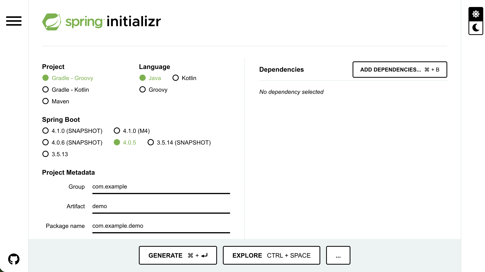

이번 포스팅은 처음 Spring_Boot를 접하는 사람들과 오랜만에 Spring_Boot를 사용하는 사람들에게 도움이 되는 포스팅 입니다. Spring_Boot 공식 문서(Spring Quickstart Guide)를 바탕으로, 가장 권장되고 표준적인 방법인 Spring Initializr를 사용하여 첫 번째 웹 애플리케이션을 만드는 방법을 단계별로 자세히 알아보겠습니다.

> 1. 사전 준비(Prerequisites)
> 2. Spring Initializr로 프로젝트 뼈대 만들기
> 3. 프로젝트 열기 및 구조 확인
> 4. 첫 번째 코드 작성하기 (Hello World)
> 5. 애플리케이션 실행하기
> 6. 결과 확인하기


<br />
<br />

## 1step. 사전 준비(Prerequistes)
---
Spring_boot를 시작하기 전에 컴퓨터에 다음 항목들이 설치되어 있어야 합니다.
* **Java**: JDK 17 이상(현재 Spring Boot 3.x 버전은 Java 17 이상을 요구합니다.)
* **IDE(통합 개발 환경)**: IntelliJ IDEA, Eclipse, VS Code, Antigravity 등

<br/>


## 2step. Spring Initializr로 프로젝트 뼈대 만들기
---
Spring Boot 공식 문서에서는 프로젝트 초기 설정을 위해 [spring initializr](https://start.spring.io/)웹사이트 사용을 가장 권장합니다.

1. 웹 브라우저를 열고 [start.spring.io](https://start.spring.io/)에 접속합니다.

2. 화면에 다음과 같이 프로젝트 설정을 선택합니다.

* **Project**: `Gradle - Groovy` (또는 Maven, 최근에는 Gradle을 많이 선호합니다.)
* **Language**: `java`
* **Spring Boot**: 미리 선택된 기본값 (보통 3.x.x 안정화 버번)을 그대로 둡니다. (SNAPSHOP이나 M, RC가 붙지 않은 버전을 선택하세요)
* **Project Metedata**
    * `Group`: 보통 회사의 도메인을 역순으로 적습니다. (예: `com.example`)
    * `Artifact`: 프로젝트 이름 (예: `demo`)
    * `Packaging`: `Jar`
    * `Java`: `17`(또는 설치된 Java 버전에 맞게 21 등 선택)

3. **Dependencies(의존성 추가)**: 우측 상단의 **[ADD DEPENDENCIES]** 버튼을 클릭합니다.
    * `Spring Web`을 검색하고 선택합니다. (이것을 추가해야 웹 서버를 띄우고 REST API를 만들 수 있습니다.)

4. 화면 하단의 **[GENERATE]** 버튼을 클릭하여 프로젝트 압축 파일(`demo.zip`)을 다운로드합니다.


>여기서 잠깐!`Tip`
Group을 `com.myname`,
Artifact를 `study`로 적었다면,
내 자바 코드들은 `src/main/java/com/myname/study/` 폴더 아래에 생성됩니다.
>
> 그래서 폴더 이름을 spring_boot_start로 프로젝트를 시작했다면
Group을 `com.본인이름`
Artifact를 `spring-boot-start`로 작성합니다.


<br/>
<br/>

## 3step. 프로젝트 열기 및 구조 확인
1. 다운로드한 `demo.zip` 파일의 압축을 해제 하빈다.
2. 사용하시는 IDE(예: VS Code)를 실행하고, 압축을 푼 폴더를 **Open(열기)** 합니다.
(Gradle 프로젝트로 인식하여 라이브러리들을 다운로드하는데 약간의 시간이 걸립니다.)

프로젝트를 열면 다음과 같은 핵심 파일들을 볼 수 있습니다.
* `build.gradle`(또는 `pom.xml`): 프로젝트의 설정과 의존성(라이브러리)이 정의되어 있는 파일입니다.
* `src/main/java/com/example/demo/demoApplication.java`: spring Boot 애플리케이션의 시작점(Entry Point)이 되는 메인 클래스입니다.


<br />
<br />

## 4step. 첫 번째 코드 작성하기 (Hello World)
---
웹 브라우저에서 접속했을 때 인사를 건네는 간단한 코드를 작성해 보겠습니다.

`src/main/java/com/example/demo/DemoApplication.java`
파일을 열고, 아래와 같이 코드를 수정합니다.

```java
package com.example.demo;

import org.springframework.boot.SpringApplication;
import org.springframework.boot.autoconfigure.SpringBootApplication;
import org.springframework.web.bind.annotation.GetMapping;
import org.springframework.web.bind.annotation.RequestParam;
import org.springframework.web.bind.annotation.RestController;

@SpringBootApplication
@RestController // 이 클래스가 웹 요청을 처리하는 컨트롤러임을 Spring에 알려줍니다.
public class DemoApplication {

    public static void main(String[] args) {
        SpringApplication.run(DemoApplication.class, args);
    }

    // "/hello" 경로로 들어오는 HTTP GET 요청을 이 메서드와 매핑합니다.
    @GetMapping("/hello")
    public String hello(@RequestParam(value = "name", defaultValue = "World") String name) {
        return String.format("Hello %s!", name);
    }
}
```
코드 설명:
* `@RestController`: 이 클래스의 메서드들이 반환하는 문자열이 그대로 웹 브라우저의 응답(Response)본문이 되도록 설정합니다.
* `@GetMapping("/hello")`: 상요자가 브러우저에서 `http://localhost:8080/hello` 주소로 접속할 대 이 메서드가 실행되도록 연결합니다.
* `@RequestParam`: URL 주소 뒤에 파라미터(예: `?name=Spring`)를 받을 수 있게 해줍니다.

<br />
<br />

## 5step. 애플리케이션 실행하기
---
코드를 다 작성했다면 서버를 실행할 차례입니다. 두 가지 방법이 있습니다.

**방법 A: IDE에서 실행하기 (가장 쉬운 방법)**
* `DemoAppolicaion.java` 파일 안의 `main` 메서드 옆에 있는 초록색 재생(▶)버튼을 클릭하고 Run 'DemoApplicaion.main()'을 선택합니다.

**방법B: 터미널에서 실행하기**
* 프로젝트의 최상위 폴더에서 터미널을 열고 다음 명령어를 입력합니다.
    * Mac/Linux: `./gradlew bootRun`
    * Windows: `gradlew.bat bootRun`(또는 `./mvnw spring-boot:run`- Maven 사용 시)

터미널이나 콘솔 창에 Spring 로고가 그려지면서 마지막에 `started DemoApplicaion in ... seconds`라는 메시지가 나오면 서버가 성공적으로 실행된 것입니다. 기본적으로 내장된 Tomcat서버가 8080번 포트에서 실행됩니다.

<br/>
<br/>

## 6step. 결과 확인하기
---
1. 웹 브라우저를 켭니다.
2. 주소창에 `http://localhost:8080/hello`를 입력하고 접속합니다.
* 화면에 **Hello World!**가 출력되는 것을 확인할 수 있습니다.
3. 파라미터를 넘겨보고 싶다면, 주소창에 `http://localhost:8080/hello?name=Spring`이라고 입력해 보세요
* 화면이 **Hello Spring!** 으로 바뀌는 것을 확인할수 있습니다.
