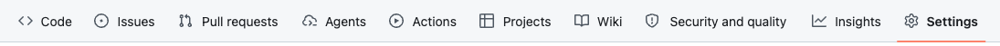
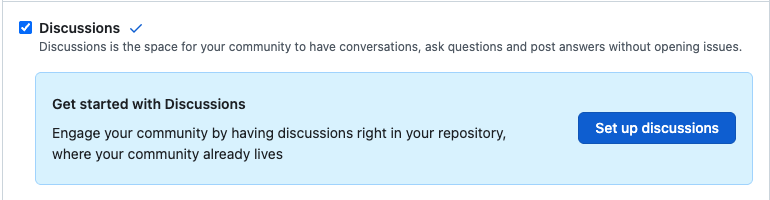
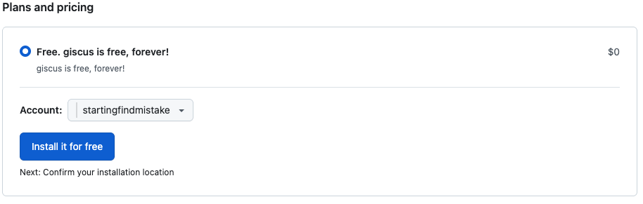
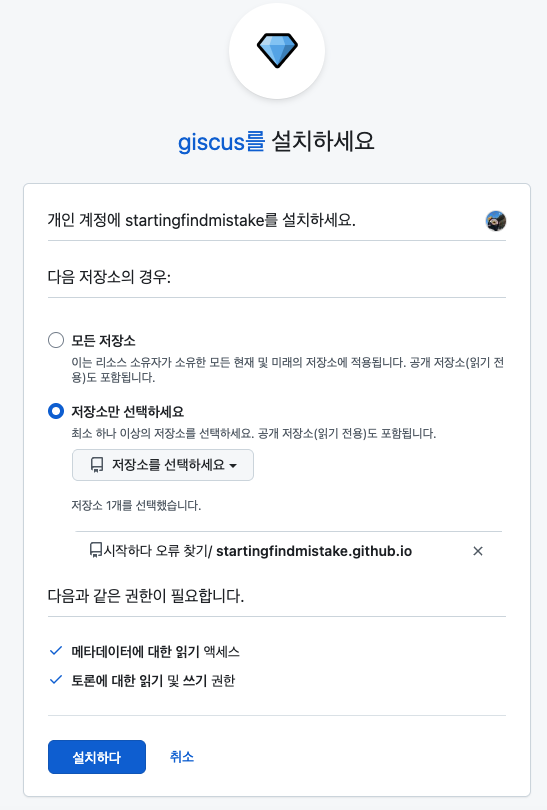
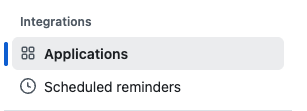
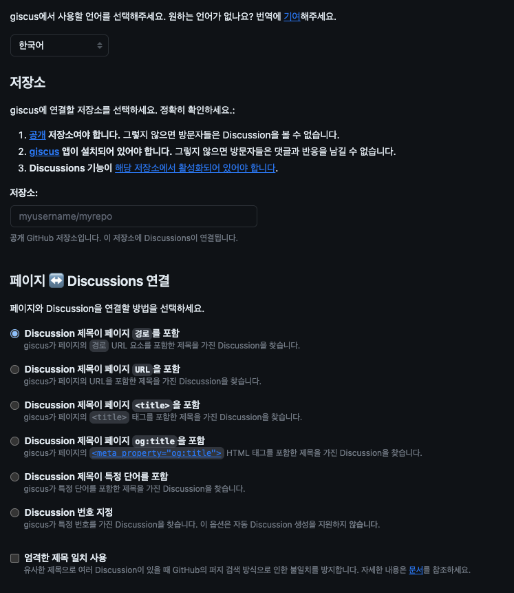
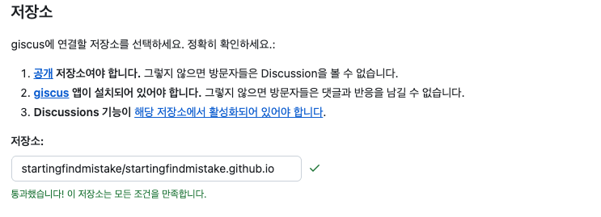

블로그 댓글 기능에Giscus(지스커스)를 추가해 보기로 결정하였다.
그 이유에 대해서는 이전 페이지를 읽어보시길 바랍니다.

**anyway**

## 📚 먼저 알아두어야 할 기본 지식

#### 1. GitHub Discussions의 개념

* Giscus는 블로그에 댓글이 달리면 해당 댓글을 연결된 GitHub 저장소의 'Discussions(토론)' 탭에 저장합니다.  
따라서 GitHub 저장소가 공개(Public) 상태여야 하고, Discussions 기능이 활성화되어 있어야 합니다.

check

* [ ] 저장소가 공개(Public) 상태여야 하고, Discussions 기능이 활성화되어 있어야 한다.

#### 2. Giscus 작동원리

* Giscus는 웹사이트에 `<script>` 태글르 삽입하여 작동합니다.  
이 스크립트가 GitHub API와 통신하며 댓글 UI를 `<iframe>`형태로 렌더링해 줍니다.  

## 🗺️ Giscus 연동 초반 계획

##### 1단계: GitHub 저장소 설정 변경

* 목표: Giscus가 데이터를 저장할 수 있는 공간 마련



* 자신의 블로그 레포레지토리(**Example**:startingfindmistake.github.io) 저장소의 `GitHub Settings` 탭으로 이동합니다.

Features 섹션에서 Discussions 체크박스를 활성화합니다. (보통 기본 카테고리로 General, Announcements 등이 생성됩니다.)

</br>
</br>

##### 2단계: GitHub에 Giscus App 설치

이 단계는 사용자님의 GitHub 계정과 저장소를 Giscus가 안전하게 연결하도록 권한을 주는 과정입니다.

1. `Github대시보드`에서 => `≡`메뉴바 클릭 => `Marketplace`메뉴로 이동 => `giscus`검색 `https://github.com/marketplace/giscus`=> `Add`버튼 클릭 =>`install for free`



</br>
</br>

`Install it for free`를 클릭하고 나면은 모든 저장소에 giscus를 적용할지 아니면 내가 선택한 저장소만 giscus를 선택할지 선택지를 준다.  
여기서 나는 블로그 댓글 기능으로 giscus를 활용할 계획이기 때문에 블로그 레포레지토리에만 giscus를 적용하기를 선택하였다.



`install(설치)` 누르고 나면 최종적으로 설치가 완료 된다.

</br>
</br>

**Giscus가 잘 설치되었는지 확인하려면**

`오른쪽 상단 프로필` 클릭 => `settings`선택 => 왼쪽 메뉴바에서 Integrations카테고리에 `Applications`선택  
</br>


그러면여기서 앱에 대한 세세한 정보를 확인할수 있습니다.

</br>
</br>

#### 3단계: 나만의 Giscus 스크립트 코드 생성하기

1. Giscus 공식 웹사이트 한국어 페이지(giscus.app/ko) 에 접속합니다.
2. 스크롤을 내리면서 아래 항목들을 순서대로 채워 넣습니다.


저장소 (Repository): startingfindmistake/startingfindmistake.github.io 라고 정확히 입력합니다.


(입력 후 아래에 '성공'이라는 초록색 메시지가 뜨는지 확인하세요. 안 뜬다면 1단계 Discussions 활성화나 2단계 앱 설치가 안 된 것입니다.)
페이지 ↔ 토론 연결 (Page ↔️ Discussions Mapping): 첫 번째 옵션인 제목에 특정 용어 포함 (pathname) 을 선택합니다. (각 블로그 글의 URL 경로를 기준으로 댓글창이 나뉘게 됩니다.)
토론 카테고리 (Discussion Category): 드롭다운에서 General 또는 Announcements 를 선택합니다.
기능 (Features): 특별히 건드릴 것은 없지만, '댓글 지연 로딩(Lazy load)'을 체크하시면 블로그 로딩 속도 향상에 도움이 됩니다.
테마 (Theme): 블로그의 디자인에 맞춰 선택합니다. 블로그가 라이트/다크 모드를 모두 지원한다면 OS 설정 기준 (preferred_color_scheme) 이 가장 무난합니다.

#### 4단계: 블로그 코드에 Giscus 스크립트 삽입하기 (Astro Starlight 기준)

Giscus 스크립트를 발급받은 후, 이를 실제 블로그 코드에 어떻게 적용했는지 그 논리적인 접근 과정을 공유합니다.

##### 1. 프로젝트 구조 파악 (상황 인지)

가장 먼저, 발급받은 Giscus 스크립트를 모든 블로그 글에 노출시키기 위해 파일 구조를 분석했습니다. 일반적으로 Astro 프로젝트에서는 `src/layouts/` 폴더에 있는 레이아웃을 수정하여 전체 페이지에 적용합니다.

* **초기 검색 시도**: 파일 구조를 살펴보기 위해 터미널에서 `find src -type f` 명령어를 사용했습니다. (`find`는 조건에 맞는 파일을 검색하는 명령어이고, `-type f`는 디렉토리를 제외한 '파일'만 찾으라는 뜻입니다.)
* **문제 발생**: `src/content/docs` 아래에 존재하는 수많은 마크다운 문서들까지 전부 출력되어, 프로젝트의 뼈대 구조를 한눈에 파악하기가 매우 어려웠습니다.
* **대안 적용**: 폴더 구조를 시각적이고 직관적으로 보기 위해, 트리 형태를 보여주는 도구(예: 코드 에디터의 파일 탐색기 또는 터미널의 `tree` 명령어)를 통해 디렉토리를 재귀적으로 확인했습니다.
* **결과 확인**: 제 블로그의 `src` 폴더 안에는 `assets`(이미지 등)와 `content`(블로그 원고)만 존재했습니다. 일반적인 프로젝트에 있는 `components`, `pages`, `layouts` 등의 폴더가 **없었습니다.** 그 이유는 제 블로그가 레이아웃과 라우팅을 알아서 처리해 주는 **Astro Starlight**라는 테마를 기반으로 구축되었기 때문이었습니다.

##### 2. 컴포넌트 오버라이딩(Overriding) 전략 수립

Starlight 테마는 기본 레이아웃이 내장되어 있어 직접 수정할 수 없지만, 대신에 헤더(Header)나 푸터(Footer) 같은 특정 구역을 **사용자가 만든 컴포넌트로 교체(Override)** 할 수 있는 기능을 제공합니다.
댓글창은 글을 다 읽고 난 후인 페이지 최하단에 있는 것이 적합하므로, Starlight의 **기본 푸터(Footer) 자리에 댓글창을 추가**하기로 논리적 방향을 잡았습니다.

* 하지만 제 프로젝트에는 직접 만든 컴포넌트를 담을 공간이 없었으므로 터미널에서 폴더를 생성했습니다.

  ```bash
  mkdir -p src/components
  ```

  (`mkdir`는 디렉토리 생성 명령어이며, `-p` 옵션은 필요하다면 상위 디렉토리까지 한 번에 생성하고 이미 폴더가 존재해도 오류를 뱉지 않게 해주는 유용한 옵션입니다.)

##### 3. 커스텀 Giscus 컴포넌트 생성 (`Giscus.astro`)

이제 만든 `src/components` 폴더 안에 `Giscus.astro`라는 파일을 만들고 다음과 같이 코드를 작성했습니다.

```javascript
---
// 1. Starlight가 원래 제공하는 기본 Footer 컴포넌트를 가져옵니다.
import Default from '@astrojs/starlight/components/Footer.astro';
---

<!-- 2. 기존 Footer(이전 글/다음 글 이동 버튼 등)를 먼저 화면에 그립니다. -->
<Default {...Astro.props} />

<!-- 3. 그 바로 아래에 여백을 조금 주고 Giscus 스크립트를 삽입합니다. -->
<div style="margin-top: 2rem;">
  <script src="https://giscus.app/client.js"
        data-repo="본인의/레포지토리"
        data-repo-id="본인의_레포_ID"
        data-category="Announcements"
        data-category-id="본인의_카테고리_ID"
        data-mapping="pathname"
        data-strict="0"
        data-reactions-enabled="1"
        data-emit-metadata="0"
        data-input-position="bottom"
        data-theme="preferred_color_scheme"
        data-lang="ko"
        data-loading="lazy"
        crossorigin="anonymous"
        async>
  </script>
</div>
```

이 방식은 기존 블로그의 내비게이션 기능(이전/다음 글)을 그대로 유지하면서 댓글 기능만 안전하게 추가할 수 있는 아주 효과적인 방법입니다.

##### 4. 환경 설정 파일(`astro.config.mjs`) 연결 작업

컴포넌트를 만들었다고 끝이 아닙니다. 프로젝트의 총괄 설정 파일인 `astro.config.mjs`에서 Starlight에게 "이제부터 기본 푸터 대신 내가 만든 `Giscus.astro`를 사용해"라고 지시해야 합니다.

`astro.config.mjs` 파일의 설정(config)을 분리하여 `starlight` 모듈 내부에 다음과 같이 매핑을 추가했습니다.

```javascript
// astro.config.mjs
import { defineConfig } from 'astro/config';
import starlight from '@astrojs/starlight';

export default defineConfig({
 // ... (기존 설정 생략) ...
 integrations: [
  starlight({
   title: 'Starting Find Mistake',
   // 이 부분을 추가하여 Footer 영역을 가로채서 오버라이딩(교체) 합니다.
   components: {
    Footer: './src/components/Giscus.astro',
   },
            // ... (기존 설정 생략) ...
  }),
 ],
});
```

설정을 파일 내부에 명시적으로 분리하여 적어둠으로써, 사이트 내 어떤 문서를 보더라도 하단에 통일된 Giscus 댓글창이 표시되도록 구현을 마쳤습니다.

## 📌 결론

이번 Giscus 댓글 기능 추가 작업을 진행하면서, 단순하게 "남들이 짜놓은 코드를 복사해서 붙여넣기" 하는 방식을 넘어서 **프로젝트의 상황을 먼저 파악하고 논리적으로 접근하는 것의 중요성**을 깊이 느꼈습니다.

1. **무작정 적용하기 전, 프레임워크의 특성 이해하기**  
   처음에 레이아웃 파일을 찾기 위해 무작정 터미널에서 검색을 시도했을 때는 방대한 마크다운 파일에 가려져 뼈대를 파악할 수 없었습니다. 하지만 디렉토리 구조를 시각적으로 분석함으로써, "내 블로그가 Astro Starlight라는 추상화된 테마를 쓰고 있기 때문에 일반적인 구조와 다르다"는 핵심 원인을 짚어낼 수 있었습니다.

2. **공식 문서와 프레임워크의 규칙(Rule) 따르기**  
   프레임워크가 내부적으로 처리하는 영역을 억지로 뜯어고치려 하지 않고, Starlight에서 제공하는 '컴포넌트 오버라이딩(Component Overriding)' 기능이라는 **정해진 규칙**을 활용했습니다. 덕분에 기존의 이전 글/다음 글 네비게이션 기능 등은 하나도 망가뜨리지 않으면서, 내가 원하는 댓글창만 깔끔하게 추가할 수 있었습니다.

앞으로 새로운 기능을 추가하거나 버그를 수정할 때에도, **"현재 프로젝트의 구조 파악 → 프레임워크의 동작 원리와 제공 기능 확인 → 가장 안전하고 합리적인 방식으로 코드 주입"** 이라는 논리적이고 체계적인 프로세스를 먼저 세우고 접근해야겠다는 확신을 얻었습니다.
