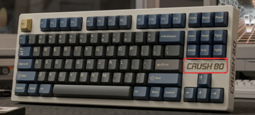

## 연결

* **연결 모드 전환:** `Fn` + `Tab`

* **블루투스(페어링):** `Fn` + `1` ~ `3` (길게 누르면 페어링/ 잛게 누르면 전환)

* **둥글 페어링:** `Fn` + `4` (길게 누르기)

## LED

---
**전체 온/오프:** `Fn` + `L`

 
 

## 아이콘 LED

---

 

**아이콘 조명 효과 바꾸기:** `Fn`+`[`  
**아이콘 조명 색상 바꾸기:** `Fn`+`]`  
**아이콘 조명 끄고/켜기:** `Fn` + `p`  

 

## 사이드 LED

---
**사이드 조명 효과 바꾸기:** `Fn` + `;`  
**사이드 조명 색상 바꾸기:** `Fn` + `"`  
**사이드 조명 끄고/켜기:** `Fn` + `?`  

 
 

## 키보드 백라이트

---
**백라이트 효과 변경:** `Fn` + `\`  
**백라이트 색상 전환:** `Fn` + `Enter`  
**백라이트 끄고/켜기:** `Fn` + `Backspace`  
**백라이트 밝기 조절** `Fn` + `↑`, `Fn` + `↓`  
**백라이트 효과 속도 조절:** `Fn` + `←` + `→`  
